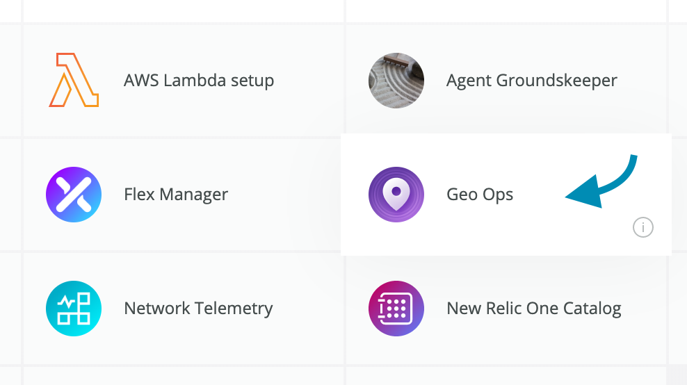
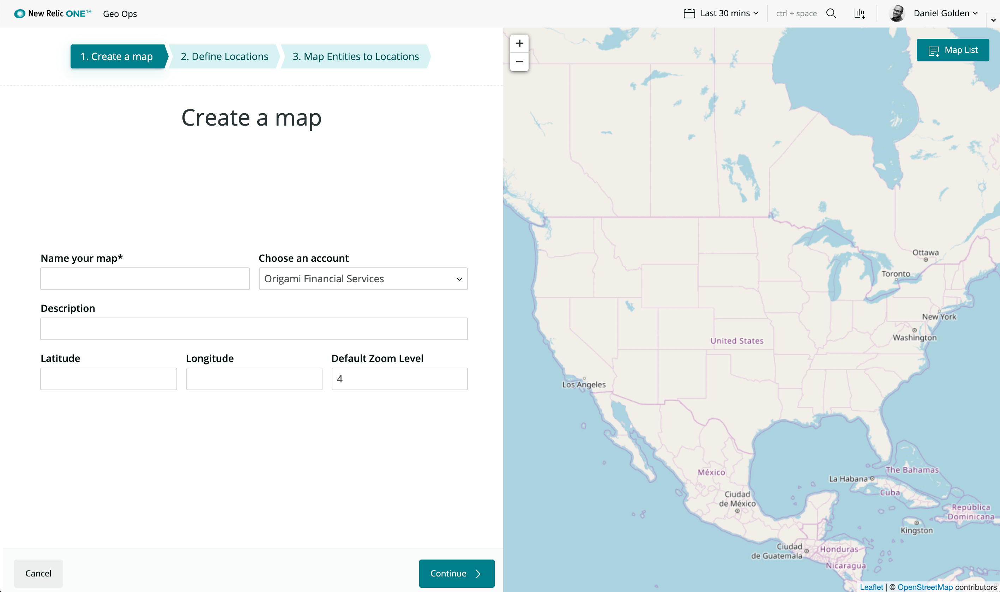
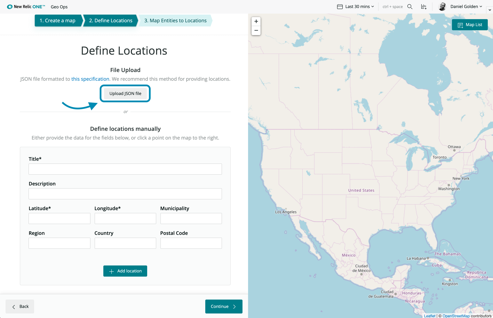
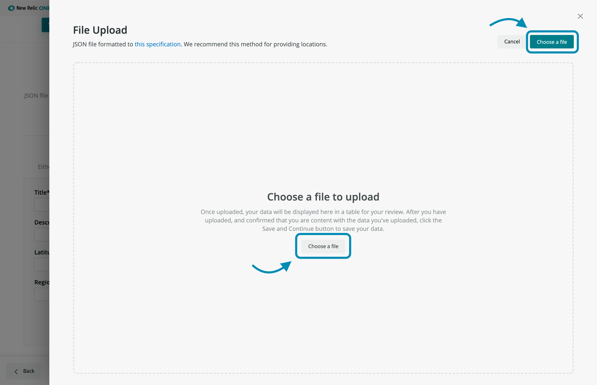
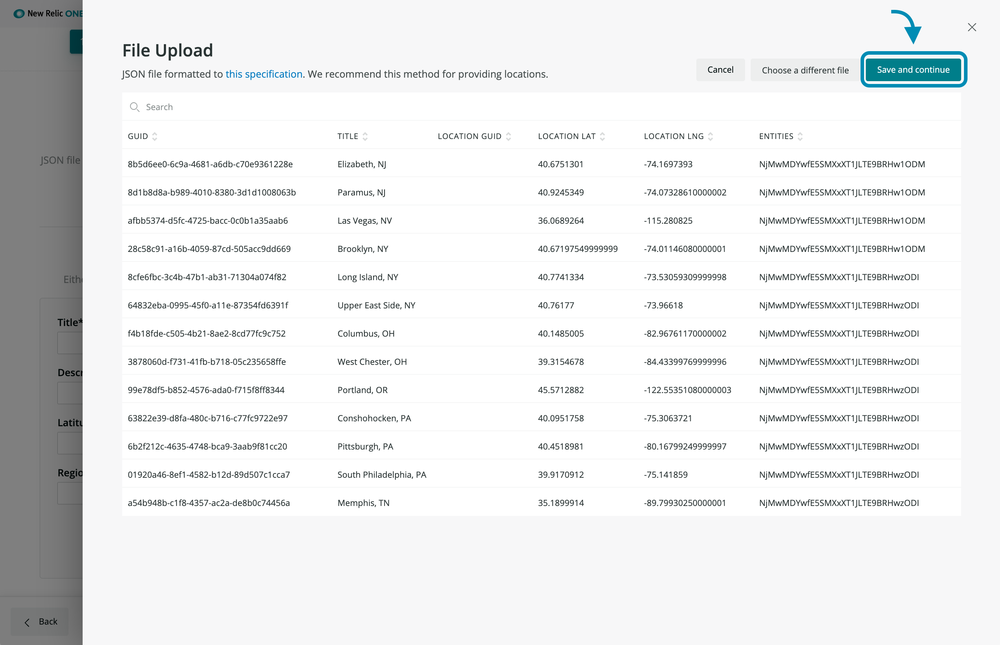
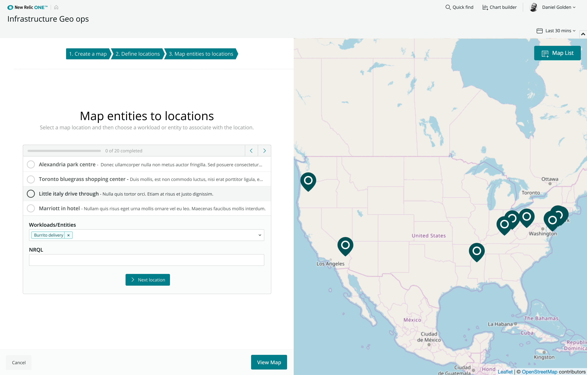
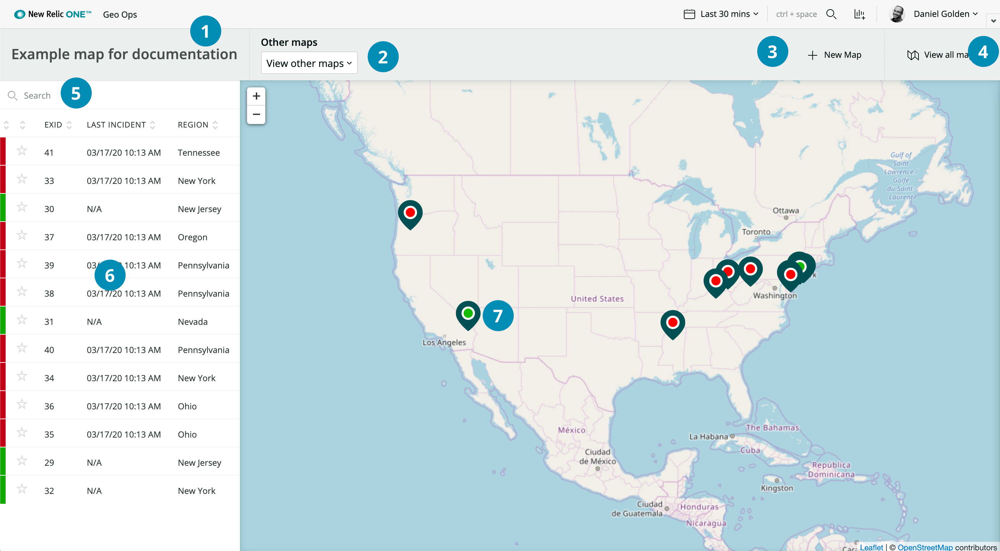
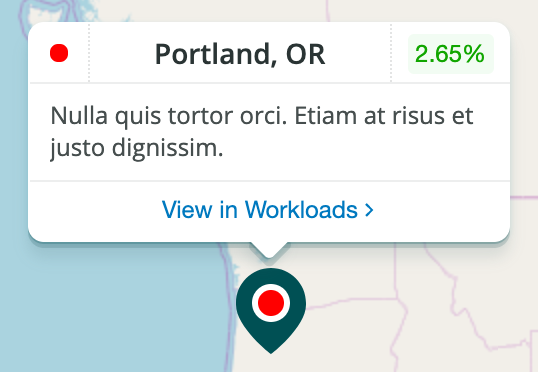
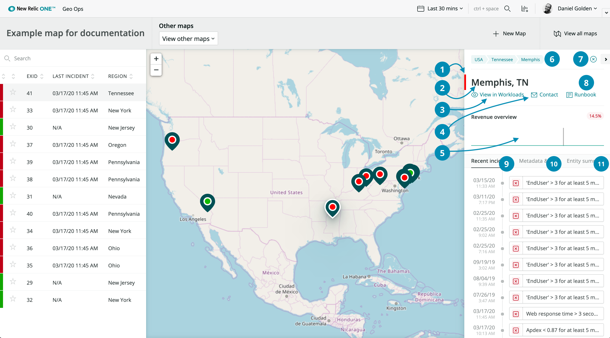
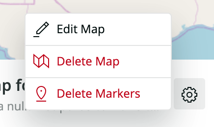

## Description

Workloads Geo-ops helps customers that do brick and mortar customer engagement connect all the tech that they use to deliver an experience to physical locations. That could look like the infra agents on their POS system, a table, but it necessarily has to also include those thing talking to services that are out in their data center. We'd like to be able to qualitatively analyze the service that is delivering service to your location to answer the question "is this service that causing issues for this location".

## Getting started
To begin using this nerdpack to analyze entities at your locations follow the steps outlined below:

1. From https://one.newrelic.com/ click on the **Geo Ops** launcher.

2. Click on one of the **Get Started** buttons on the screen. 

3. Fill out the **Create a Map** form by providing the essential data for your map, then click **Continue**. (Hint: You can click anywher on the map on the right side of the screen to provide the longitude, latitude, and zoom level). 

4. Define your locations by uploading a JSON file (recommended) or by manually adding them one by one. Then click **Continue** at the bottom of the screen.

	1. Click **Upload JSON file**
	2. Click **Choose a file** in the slide-out window that appears 

	3. Select a JSON file from your files that follows our specification.
	4. Review the data that you've uploaded, and if you're satisfied with it click **Save and continue**. (If you're not satisfied with your data, you can **Choose a different file**)

5. Map each of your locations to one or more entities, then click **View map**. 

	- This is done by clicking on each of your locations one at a time and choosing an entity and/or workload as well as a NRQL query in the form below. 
	- The NRQL query will be used in your map to display a chart and comparison data for each of your locations. 
	- (If you have already provided this data in your JSON file, which you can tell by looking at your list of locations and seeing whether *each* location is checked with a line through it on the list, then just click **View map**) 

6. You're done, you've just created your first map!

## Using your maps

### Overview of the map UI

1. **Map title**: The title you provided for your map.
2. **Other Maps**: A dropdown used for selecting which one of your maps you have access to (if you have more than one).
3. **New Map** button: The quickest way to create a new map from this screen.
4. **View all maps** button: When clicked, you will be presented with a screen where you can see a visual grid of all of your maps with an option to edit them.
5. **Search locations**: A field which can be used to search your locations.
6. **Locations table**: a table which displays all of your locations for the map you're viewing (Hint: these locations can be favorited for quicker access to your most used locations. Just click on the star on any one of the table rows an you'll be able to sort by favorites).
7. **Location marker**: a marker represention one of your locations which displays a status color based on the presence or absence of recent violations on the entity associated with the location. *When hovered* a popover will appear which displays the following information about the location: 

	- The **status** of the entity (via a colored dot in the top right)
	- The **name** of the location
	- **A comparison metric** which is provided by the NRQL query you provided when you added your locations to the map (see step 5 of getting started)
	- The **description** of the location
	- A "**view in workloads**" button which, when clicked displays the entity explorer or workloads view of the entity (or entit*ies*) associated with the location

### Overview of the Detail Panel
When you click on any of the location markers on the map or any of the locations in the location table, the marker for that location is highlighted and a detail panel is displayed on the right which provides more data about the location you've selected.

1. **Location status**: a subtle block of color which denotes the status of the locations
2. **Location title**: The title of the location
3. **View in Workloads** button: When clicked, opens up an modal window which displays data on the entities/workload(s) associated with the location.
4. **Contact** button: an email link to contact someone at the location.
5. **NRQL Chart**: A chart generated by the NRQL query provided during the definition of locations (see Getting Started step 5)
6. **Location breadcrumbs**: Describe the heirarchy of the location (e.g. Country > Region > Municipality)
7. **Close & Minimze controls**: The close and minimize controls which close and minimize the detail panel respectively.
8. **Runbook link**: A link to the runbook defined at the map or location level.
9. **Recent Incidents** tab: A timeline of recent incidents associated with the location.
10. **Metadata & Tags**: A series of key:value pairs tied direclty to the location (e.g. title, lat, lng,  guid, lastIncidentTime, etc.)
11. **Entity Summary**: A table listing all entities associated with this location (including entities tied to a workload).

### Overview of the All Maps page
When you click on the "View all Maps" on any map page, you will be taken to a page which displays a visual grid of all of your maps with an option to edit them. To edit one of your maps, click on the settings icon next to the title of the map you'd like to edit.

Once, clicked, a settings popover will appear which will offer you options for the following actions:

1. **Edit Map**: Edit the metadata of your map and locations (including the ability to update the entities associated with your locations).
2. **Delete map**: Deletes the map and all locations associated with it.
3. **Delete locations**: Deletes the locations associated with the map, but does not delete the map itself.